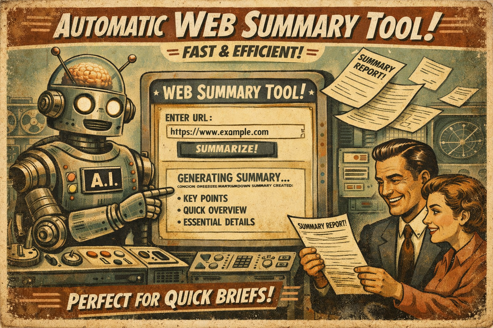
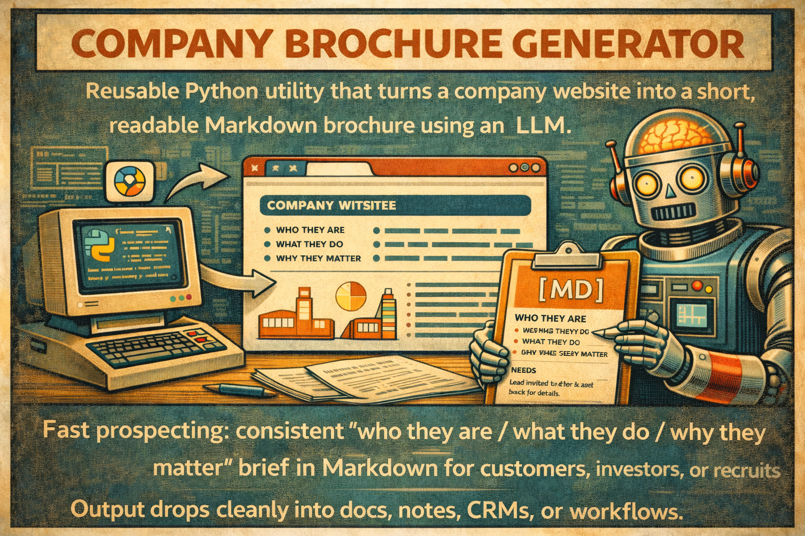
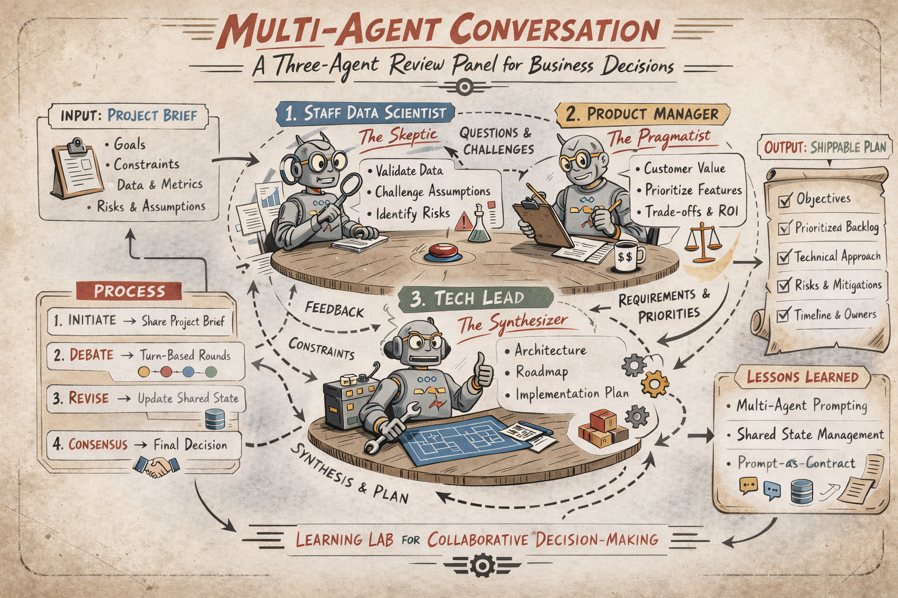
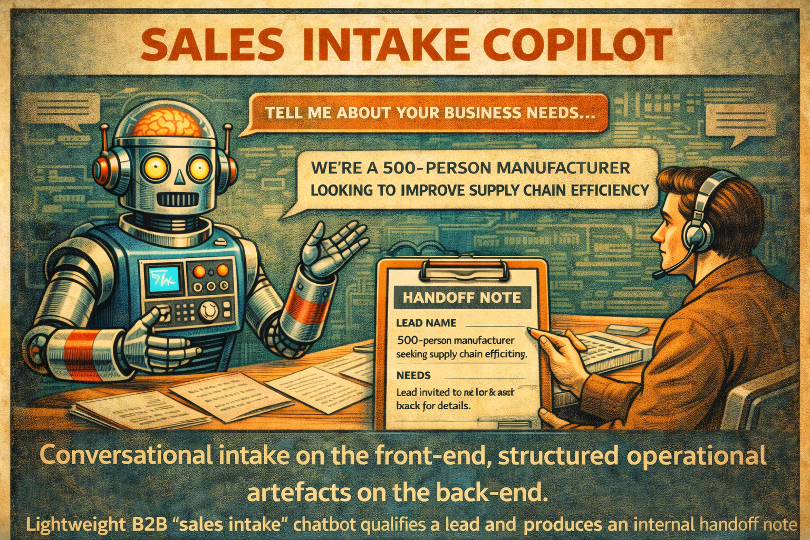
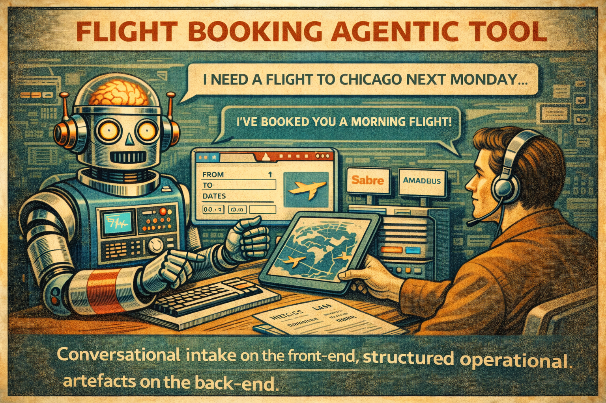
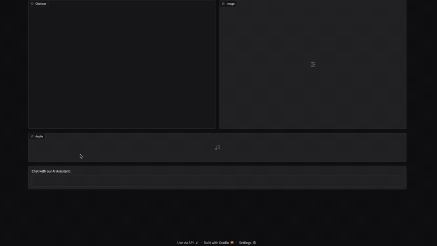
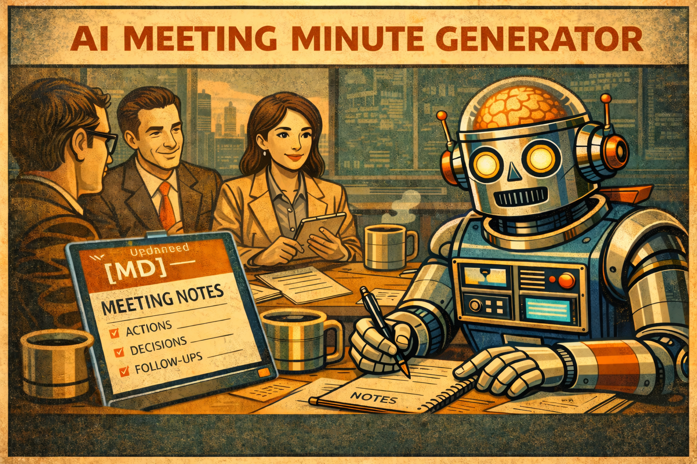

# LLM Engineering Lab

  

## Motivation
This repo is where I build LLM capabilities that hold up in real work. It presents a curated set of deployable Python utilities that apply LLMs to real workflow problems.

The emphasis is control and reuse. Prompts are treated as contracts (tone, length, structure), multi-step pipelines are used when they improve relevance, and outputs are produced as Markdown/JSON so they drop cleanly into docs, notes, tickets, and downstream tools.

## Contents
- [Web Summary Tool](#web-summary-tool)
- [Company Brochure Generator](#company-brochure-generator)
- [Tech Tutor](#tech-tutor)
- [Multi-Agent Conversation](#multi-agent-conversation)
- [Sales Intake Copilot](#sales-intake-copilot)
- [Flight Booking Agentic Tool](#flight-booking-agentic-tool)

---

# Projects

## [Web Summary Tool](./ai_web_summary_tool/)

  

A small, deployable Python utility that turns a webpage URL into a concise Markdown summary using an LLM. It’s designed to be embedded into internal workflows where people need quick, repeatable briefs from unstructured web content.

### Business problem

Stakeholders often need to extract decision-relevant information from long webpages (announcements, reports, research posts). Manual summarisation is slow, inconsistent, and doesn’t scale across many sources.

### What it does

Given a URL, `web_summary_tool(...)`:
- fetches and extracts the readable text from the webpage
- applies a safety cap (`max_chars`) to prevent oversized prompts
- generates a short summary in Markdown via a chat model
- can run via either a hosted API (OpenAI) or a local open-source model (Ollama)
- either returns the summary text or renders it (controlled by `show`)

### Tone / “personality” control

The tool accepts a `chat_personality` parameter to adapt tone and framing to the audience. This is useful when the same underlying content needs to be summarised differently depending on context (e.g., a terse executive brief vs. a more detailed analyst-style summary). The output remains Markdown so it can drop cleanly into docs, notes, or downstream pipelines.

### Interface

`web_summary_tool(url, chat_personality="…", openai_model="…", ollama_model="…", max_chars=25000, show=True, run_open_ai=True, run_ollama=True)`

- `url`: webpage to summarise  
- `openai_model`: hosted chat model used when `run_open_ai=True`  
- `ollama_model`: local model used when `run_ollama=True`  
- `max_chars`: crude guardrail to limit prompt size  
- `show`: if `True`, displays Markdown; if `False`, returns results as strings  
- `run_open_ai`: enable OpenAI backend (requires `OPENAI_API_KEY`)  
- `run_ollama`: enable Ollama backend (requires Ollama installed and running locally)

---

## [Company Brochure Generator](./company_sales_brochure_generator/)

  

A reusable Python utility that turns a company website into a short, readable Markdown brochure using an LLM. It’s designed for fast prospecting: generating a consistent “who they are / what they do / why they matter” brief for customers, investors, or recruits — with Markdown output that drops cleanly into docs, notes, CRMs, or downstream workflows.

### Business problem

When evaluating companies (for sales, investing, partnerships, or job applications), the relevant information is spread across multiple pages (About, Products, Careers, Customers). Manually collecting and synthesising this is slow, noisy, and inconsistent — especially when you need to do it repeatedly across many companies.

### What it does

Given a company name and homepage URL, `brochure_generator(...)`:
- collects candidate links from the homepage
- uses a chat model to select a small set of brochure-relevant pages (e.g., About, Products, Careers)
- fetches the text content for the homepage + selected pages
- generates a short brochure in Markdown (no code blocks) covering:
  - what the company does and who it serves
  - products / services and key differentiators (if present)
  - culture and hiring signals (if present)
- optionally translates the brochure into a target language (preserving Markdown structure)
- returns the final Markdown string (optionally streaming it during generation in interactive environments)

### Notes on the design (why it’s structured this way)

This project is a minimal “agentic” workflow: instead of a single giant prompt, it chains multiple LLM calls with a clear intermediate artefact.

- **Step 1: page selection (planning / routing)**  
  The model first decides which pages are worth reading for a brochure (About, Products, Careers, Customers). This reduces noise versus scraping everything.

- **Step 2: content synthesis (generation)**  
  A second call writes the brochure using the retrieved page text as evidence, producing a consistent output format in Markdown.

This two-stage pattern (select → generate) generalises well beyond brochures, for example:
- marketing copy generation from a website + product pages
- investor-style briefs from public company pages
- recruitment briefs from About + Careers pages
- tutorials / internal docs generated from specs + docs pages

### Interface

`brochure_generator(company_name, url, model="gpt-4.1-mini", max_pages=6, translate=False, language="Spanish")`

- `company_name`: label used to frame the brochure narrative  
- `url`: company homepage to crawl  
- `model`: chat model used for both link selection and brochure generation  
- `max_pages`: maximum number of “relevant” pages to fetch in addition to the landing page  
- `translate`: if `True`, returns the brochure in the requested language  
- `language`: target language for translation (e.g., `"Spanish"`, `"French"`)

### Demo app (Gradio)

A lightweight Gradio UI is included to demonstrate how the utility can be embedded in an interactive tool (local demo; not production hosted). It calls `brochure_generator(...)` under the hood and renders the brochure as Markdown.

- entry point: `./company_sales_brochure_generator/app.py`
- run locally:
  - ensure `OPENAI_API_KEY` is set (via `.env` or environment)
  - start the app: `python company_sales_brochure_generator/app.py`

---

## [Tech Tutor](./tech_tutor/)

  

A small, reusable Python utility that answers questions about data work (data engineering, data science, machine learning, and general software concepts) and explains code in clear Markdown using an LLM. It’s designed for fast learning loops: ask a question, paste a snippet, get a memorable explanation you can drop into notes, docs, or study material.

### Business problem

People working in data roles constantly encounter unfamiliar concepts, jargon, and code patterns (model behaviour, pipeline logic, SQL idioms, ML tooling). Searching the web often yields fragmented answers, and generic AI responses can be either overly technical or overly “tutorial-ish”. What’s missing is a consistent, high-signal tutor that can explain *precisely* and *memorably* on demand.

### What it does

Given a question (and optionally a code snippet), `tech_tutor(...)`:
- produces a concise, high-signal explanation aimed at a competent coder new to the specific topic
- uses a single movie-based analogy thread (configured via `favourite_movie`) to make the concept stick without overshooting into fan-fiction
- supports both concept explanations and “what does this code do?” walkthroughs (plus practical gotchas)
- returns Markdown suitable for pasting into notes / docs, and can optionally render it when running interactively
- can run via either a hosted API (OpenAI) or a local open-source model (Ollama)

### Tone / “storytelling” control

The tutor is deliberately designed to be more memorable than a standard technical answer. The analogy is not a decorative add-on: it’s used as the backbone of the explanation, with short technical “translations” to keep the answer rigorous. This makes it useful for learning, interview prep, and quickly internalising new patterns.

### Interface

`tech_tutor(question, code=None, favourite_movie="…", openai_model="…", ollama_model="…", temperature=0.7, show=True, run_open_ai=True, run_ollama=True, ollama_base_url="http://localhost:11434/v1")`

- `question`: the concept or code question to answer  
- `code`: optional code snippet to explain  
- `favourite_movie`: the story universe used for the analogy thread  
- `openai_model`: hosted chat model used when `run_open_ai=True`  
- `ollama_model`: local model used when `run_ollama=True`  
- `temperature`: creativity level (higher = more playful analogies)  
- `show`: if `True`, renders Markdown in interactive environments; otherwise returns strings  
- `run_open_ai`: enable OpenAI backend (requires `OPENAI_API_KEY`)  
- `run_ollama`: enable Ollama backend (requires Ollama installed and running locally)  
- `ollama_base_url`: OpenAI-compatible local endpoint for Ollama

### Demo app (Gradio)

A lightweight Gradio UI is included to demonstrate the tutor in an interactive setting (local demo; not production hosted). It supports streaming responses, switching between OpenAI and Ollama backends, and optionally pasting code alongside the question.

- entry point: `./tech_tutor/src/app.py`
- run locally:
  - ensure `OPENAI_API_KEY` is set (via `.env` or environment)
  - start the app: `python -m tech_tutor.src.app`

---

## [Multi-Agent Conversation](./agentic_conversation/)

  

A small Python project that orchestrates a turn-based, three-agent “review panel” conversation. Each agent plays a business-relevant role — a skeptical Staff Data Scientist, a pragmatic Product Manager, and a Tech Lead who synthesizes the debate into a shippable plan. It’s designed as a learning lab for multi-agent prompting, shared state management, and prompt-as-contract discipline.

### Business problem

Multi-agent workflows often fail in subtle ways: stale context, role drift, duplicated state updates, and inconsistent turn-taking. These failures are easy to miss in demos but break reliability in real use cases such as decision reviews, red/blue teaming, and structured critique → synthesis pipelines.

### What it does

Given a topic, `agentic_conversation(...)`:
- initializes a shared conversation transcript (the single source of truth)
- runs a turn-based loop where agents respond in sequence using role-specific system prompts
- appends each response back into the shared state so subsequent turns condition on the evolving dialogue
- produces a transcript that can be inspected, logged, or adapted into downstream workflows (e.g., “debate → decision memo”)

### Notes on the design (why it’s structured this way)

This project is intentionally small, but it surfaces core multi-agent engineering pitfalls:
- **State is the source of truth**: each turn must be generated from the latest transcript, not a frozen prompt string.
- **Prompt contracts**: each agent is constrained to a stable role, tone, and response length to reduce drift.
- **Turn-taking discipline**: one agent speaks at a time, and state updates happen exactly once per turn to avoid duplication.
- **Synthesis as a deliverable**: the Tech Lead role is explicitly responsible for converging toward actionable next steps.

### Interface

`agentic_conversation(topic: str, conversation_length: int = 5)`

- `topic`: discussion topic to evaluate in a business context  
- `conversation_length`: number of full rounds (Alex → Blake → Charlie) to run  

### Code

Entry point script: `./agentic_conversation/src/multi-agent-chat.py`

---

## [Sales Intake Copilot](./sales_chatbot_assistant/)

  

A lightweight B2B “sales intake” chatbot that qualifies a lead in a few turns and produces an internal handoff note for a human sales rep. It’s designed to demonstrate a business-realistic pattern: conversational intake on the front-end, structured operational artefacts on the back-end.

### Business problem

In many B2B workflows, inbound leads arrive with incomplete context. Sales teams waste time in back-and-forth messages to extract basic qualification details (use case, timing, size, decision ownership), and handoffs between marketing → SDR → AE are often inconsistent or missing key information.

### What it does

Given a user message, the chatbot:
- responds naturally to the user and asks a small number of targeted qualifying questions
- captures key lead attributes (use case, industry, company size, timeline, budget, authority)
- produces an internal “handoff note” in a consistent template so a human rep can take over quickly
- avoids inventing details

### Interface

`sales_assistant_stream(message, history)`

- `message`: the latest user message  
- `history`: prior turns in Gradio “messages” format (`[{role, content}, ...]`)  
- `model`: chat model used to generate the reply + handoff note (currently `gpt-4.1-mini`)

### Demo app (Gradio)

A lightweight Gradio UI is included to demonstrate the intake flow in an interactive setting (local demo; not production hosted). It calls `sales_assistant_stream(...)` under the hood.

- entry point: `./sales_chatbot_assistant/src/app.py`
- run locally:
  - ensure `OPENAI_API_KEY` is set (via `.env`)
  - start the app: `python -m sales_chatbot_assistant.src.app`

---

## [Flight Booking Agentic Tool](./price_ticket_agentic_tool/)

  

A small Gradio app that demonstrates tool-calling with a real stateful backend: the assistant can quote return ticket prices from SQLite and create mock bookings with booking IDs and departure times. It’s designed as a minimal “agentic” pattern: structured tool schemas + a tool router + a multi-step loop that keeps the model and tool outputs in sync.

### Business problem

In many customer support or sales workflows, users ask simple, repeatable questions (“what’s the price to Tokyo?”) and then want to take an action (“book it”) without a human operator. Pure chat responses are not enough: you need deterministic retrieval and a reliable way to write state (even if mocked) while keeping the conversational experience intact.

### What it does

Given a chat history, the agent:
- calls `get_ticket_price` to retrieve prices from a SQLite `prices` table
- asks for confirmation before booking, then calls `book_ticket` to insert a new row into a `bookings` table (autoincrement booking IDs)
- returns a one-sentence reply to the user, plus:
  - an autoplay TTS audio version of the reply
  - an optional destination image generated from the first city referenced in tool calls

### Notes on the design (why it’s structured this way)

This project is intentionally small, but it captures the core mechanics you need for reliable tool use:
- **Prompt-as-contract**: the system prompt enforces one-sentence answers and “confirm before booking”.
- **Tool schemas as interfaces**: JSON schemas constrain the model’s tool-call arguments (`destination_city`, optional `depart_at`).
- **Tool-call loop discipline**: the app executes tool calls, appends both the tool request and tool results back into `messages`, and re-calls the model until it returns a final response (supports multi-step tool usage).
- **Stateful backend**: SQLite provides deterministic retrieval and a persistent booking record (mock but real state).

### Interface

`booking_agent(history) -> (history, voice_audio_bytes, image)`

- `history`: Gradio “messages” format (`[{role, content}, ...]`)
- `voice_audio_bytes`: TTS audio bytes for autoplay
- `image`: PIL image for the destination (optional)

### Demo app (Gradio)

A lightweight Gradio Blocks UI is included to demonstrate the full loop (chat → tool call → response), with audio + image outputs.

- entry point: `./price_ticket_agentic_tool/src/flight_booking_agent.py`
- run locally:
  - ensure `OPENAI_API_KEY` is set (via `.env` or environment)
  - start the app: `python price_ticket_agentic_tool/src/flight_booking_agent.py`

---

## [Meeting Minute Generator](./meeting_minute_audio/)

  

A Python utility that turns meeting audio into structured Markdown minutes using an LLM. It’s designed for workflows where meetings happen frequently, recordings exist, and teams need consistent documentation without relying on manual note-taking.

### Business problem

Minutes are a core operational artefact: they capture decisions, context, and action items. When they are missing or inconsistent, teams lose accountability, repeat discussions, and waste time rebuilding context for stakeholders who weren’t in the room.

### What it does

Given an audio recording, `meeting_minute_generator(...)`:
- transcribes the meeting audio
- generates minutes in Markdown with a fixed, contract-driven structure:
  - summary (attendees/date/location if stated)
  - key discussion points (controlled granularity)
  - takeaways
  - action items with owners and due dates (if stated)
- avoids inventing details: missing information is explicitly marked as *Not specified*
- saves the exact transcript used for each run for traceability and debugging
- renders Markdown in notebooks or prints clean output in terminal runs

### Notes on the design (why it’s structured this way)

This tool prioritises reliability over creativity:
- **Prompt-as-contract** to enforce consistent format and detail level
- **Low-temperature generation** to reduce run-to-run variability
- **Faithfulness guardrails** to avoid invented metadata or action items
- **Transcript persistence** to diagnose whether issues are transcription- or summarisation-driven

---